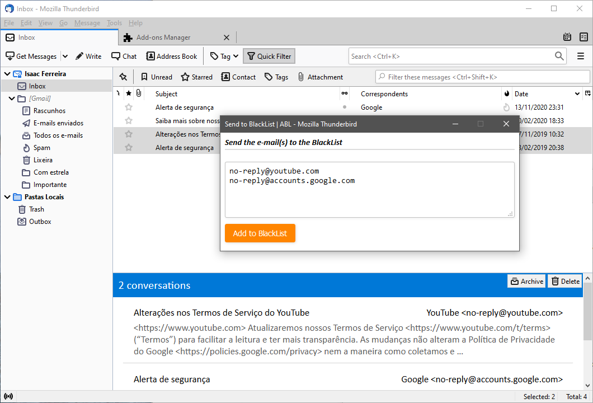
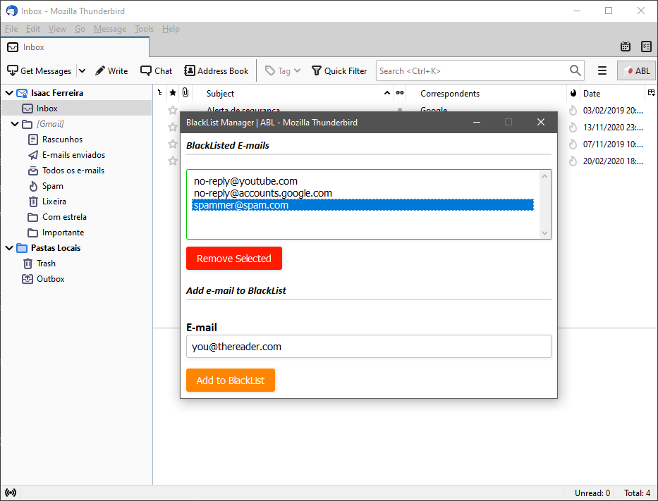
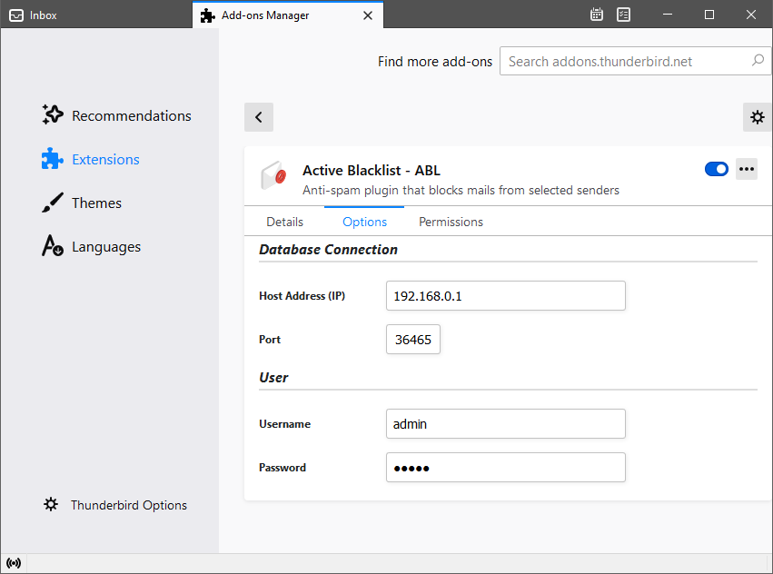

# Active Blacklist - ABL

This plugin allow you to send e-mails to be blocked by the ABL - Active BlackList.

# Thunderbird Plugin
Complatible with Thunderbird 78+

Based on: https://github.com/mbemvieira/plugin-antispam

# Screenshots

